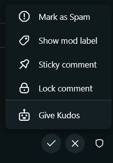
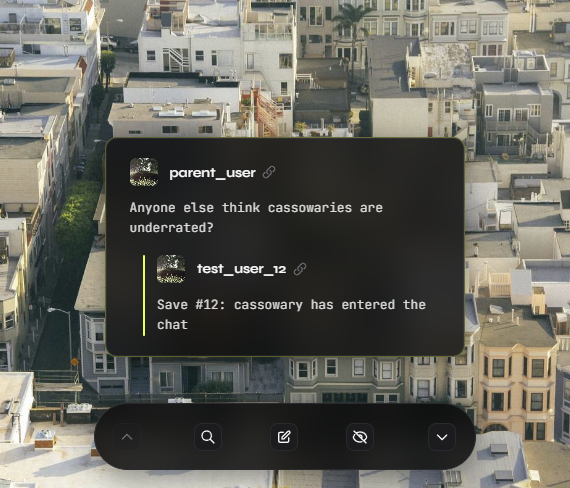

# Kudos

This is a [devvit app](https://developers.reddit.com/docs) that is a mod tool to help highlight the positive comments in their communities.

A mod would simply click on the mod actions for a comment and click the "Give Kudos" button



Then that comment would show up in the Kudos post (along with the parent comment if it exists).



## Features

- Adding comments from the mod actions of a comment, this will auto redirect you to the post.
- All users can see comments that were given kudos, and can scroll through them.
- The comments overlay the image of the post (uses the thumbnail) or a fallback image if its a text post.
- The mod who added a kudos can move the comment around if they deem it looks better and change the style
- Comments are linked back to the original post
- Comments can be searched for via their search code (which is posted on the kudos post)
- Mods can create new Kudos posts via the subreddit mod menu, which all new kudos given will be added to.

## Getting started

This project uses [vite plus](https://viteplus.dev/) for its build system so the quick start includes (expects pnpm to be installed).

```sh
vp install
vp dev
```

which will install the dependencies and start the dev server which is accessible at localhost:7474 by default.

For local dev, make sure the .env contains `USE_MOCKS=true` to use mock data otherwise the app won't work because it does not have a devvit context otherwise.

To prepare to deploy to reddit:

```sh
vp build # builds the frontend
vp pack  # builds the backend
npx devvit playtest
```

For running on reddit via `devvit playtest` or otherwise, make sure `USE_MOCKS=false` is set so it will use real reddit data.

## Project structure

Devvit web apps are by design split into a client with at least one html entrypoint, in this project its `src/client/index.html` and a node server which uses hono for the api routes, its entry point is `src/server/index.ts`

Any shared types between the client and server are present in `src/shared/types/api.ts`.

All entry points are defined in `devvit.json`
